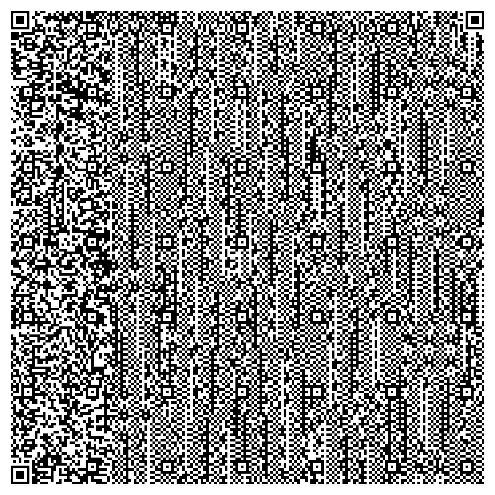
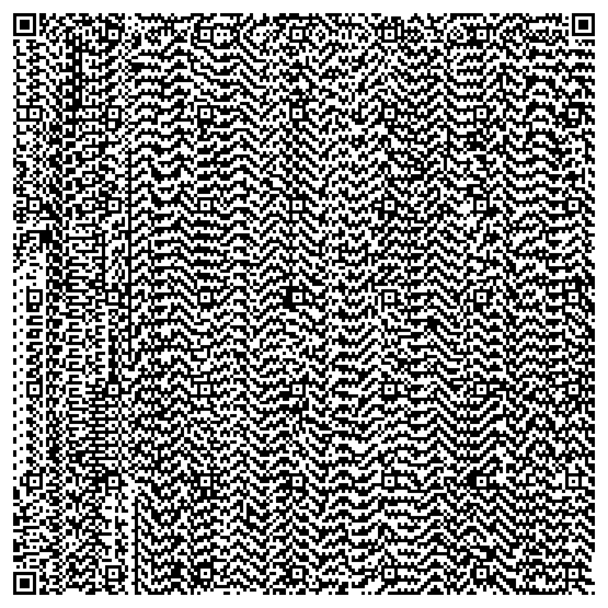

# QR Code Image Embedder and Decoder

## Overview
This project aims to embed actual image data (such as monochrome BMP or grayscale PNG images) directly into QR Codes and develop a reliable decoding system that extracts and displays the embedded images. It also supports standard QR codes containing text data.

---

## Project Progress

### ✅ Completed Tasks

- **Image Generation**:
  - Successfully generated monochrome BMP and grayscale PNG images using Python (`PIL`).

- **QR Code Embedding**:
  - Embedded binary image data into QR codes using Python's `qrcode` library.
  - Optimized QR codes using maximum data capacity (`Version 40`, `Error Correction Level L`).

- **QR Code Decoding Web App (Django)**:
  - Created a Django application to upload QR code images.
  - Implemented QR code decoding using `pyzbar` and image handling using `PIL`.
  - Successfully identified and differentiated between textual data and embedded binary image data.

---

## ⚠️ Issues Encountered

- **Issue 1**: Initially, decoded binary data was incorrectly displayed as plain text.
  - **Resolution**: Utilized Python's `imghdr` module to detect image types and base64 encoding to render images properly in HTML.

- **Issue 2**: UnboundLocalError due to incorrect variable handling.
  - **Resolution**: Corrected variable references ensuring proper definitions and assignments.

- **Issue 3**: NameError for undefined variables (e.g., `pil_image`).
  - **Resolution**: Clearly defined and properly referenced variables, rectifying typographical errors.

- **Issue 4**: Incorrect or corrupt image displayed from QR data.
  - NOT RESOLVED YET

---

## ⚙️ Technologies Used

- **Python**
- **Django** (for web app)
- **PIL (Pillow)** for image handling
- **qrcode** library for QR code generation
- **pyzbar** for decoding QR codes
- **imghdr** module for identifying embedded image types
- **HTML/CSS** for frontend rendering

---

## 🚧 Outstanding Issues and Next Steps

- **Decoder robustness**:
  - Improve error handling for corrupted or unexpected QR data.

- **Performance Optimization**:
  - Handle larger or higher resolution images efficiently.

- **User Interface Enhancement**:
  - Create a more polished and responsive frontend interface for the decoding web app.

- **Extensive Testing**:
  - Conduct comprehensive tests with various image types, sizes, and standard QR codes.

---

## 📌 Instructions for Running the Current Project

### Step-by-Step

1. **Install Dependencies**:
```bash
pip install django pillow qrcode opencv-python pyzbar numpy
```

2. **Run Django Application**:
```bash
python manage.py makemigrations
python manage.py migrate
python manage.py runserver
```

3. **Access Web App**:
- Visit `http://127.0.0.1:8000/` and upload a QR code image to decode.

---

## ✅ Current Status

The application currently:
- Generates images (BMP, PNG).
- Embeds images correctly into QR codes.

Further enhancements are recommended for improved robustness, UI/UX, and extensive testing.
Some areas for improvement include:
- Decoding QR codes and displaying embedded images or textual content accurately.
- Currently, only BMP images are getting decoded, but incorrectly.

---

## 📁 Input and Output
- **Input**: Generated monochrome BMP or grayscale PNG images.
1. BMP Image: 
2. PNG Image: 

- **Image Embedded QR**: Generated QR Code with the Image Data Embedded in it:
1. QR With BMP: 
2. QR With PNG: 

- **Output**: QR code images with embedded image data; decoded image or textual data from QR codes.
1. WRONG BMP Output: 
2. No PNG Output is getting generated. Only the following data is getting decoded from the QR: 
```
Decoded Data:
‰PNG


IHDRddU‰ÊˆúIDATxœíØÁ‚@CQ0þ·áËe塷ϏHYí̱3„ßÃñ×ã#H A‚	$È0<kñéóáU5úoÓò²‘/¢À˜È*a3²I˜ŒswI~uš…FxL b¬fqLâ”Óˆk@²ÿ)ìÑÙö&•"2ÝݤVD廛ü
RÝ1âË$ÈqHé½]¸ÃrƒT7e;ßݤXE¤Û›”ª¨l“B™„&®¢s´\ž)ÜG¡o<+˜0î.šƒÿ…sëYŒõ¼ÎÙÊ&³ï)Ñ*³ÿy×:êäî÷ëÈ A‚	$Hndé)·4äÅIEND®B`‚
```
---

## 📝 Image QR Generator Code

### Generate Monochrome BMP/Grayscale PNG
```python
from PIL import Image, ImageDraw

# Monochrome BMP example
def create_monochrome_bmp(filename="image.bmp", size=(100, 100)):
    img = Image.new('1', size, color=1)  # 1-bit image, white background
    draw = ImageDraw.Draw(img)
    draw.rectangle([20, 20, 80, 80], fill=0)  # black rectangle
    img.save(filename, format="BMP")

# Grayscale PNG example
def create_grayscale_png(filename="image.png", size=(100, 100)):
    img = Image.new('L', size, color=255)  # 8-bit grayscale, white background
    draw = ImageDraw.Draw(img)
    draw.ellipse([25, 25, 75, 75], fill=128)  # gray circle
    img.save(filename, format="PNG")

# Example Usage
create_monochrome_bmp()
create_grayscale_png()
```

### Embed the Image in QR
```python
import qrcode

def embed_image_to_qr(image_path, qr_filename):
    with open(image_path, 'rb') as file:
        binary_data = file.read()

    qr = qrcode.QRCode(
        version=40,
        error_correction=qrcode.constants.ERROR_CORRECT_L
    )
    qr.add_data(binary_data, optimize=0)
    qr.make()

    qr_img = qr.make_image(fill_color="black", back_color="white")
    qr_img.save(qr_filename)

# Example Usage:
embed_image_to_qr('image.bmp', 'qr_with_bmp.png')
embed_image_to_qr('image.png', 'qr_with_png.png')
```

