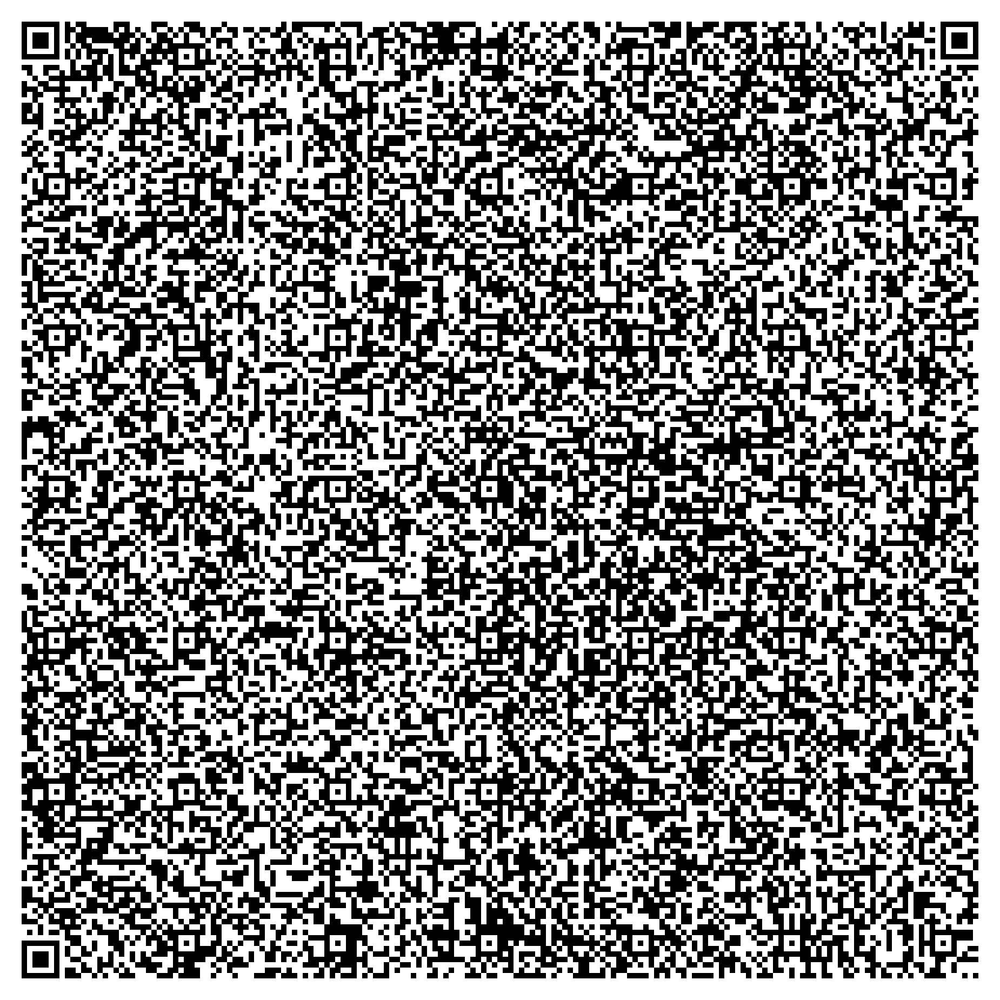

# QR Code Image Embedder and Decoder

## Overview
This project demonstrates how to embed actual image data (BMP and PNG images) directly into QR codes using base64 encoding. It also provides a reliable decoding system to extract and render the embedded images via a Django web application. Additionally, a new route has been added to compress uploaded images until they fit within the QR code's data capacity, then generate and share the QR code. The system supports both image embedding and standard QR codes containing text data.

---

## Quick Input/Output Table

| **Input Image** | **Generated QR Code** | **Decoded Output** |
|-----------------|-----------------------|--------------------|
| *(Input Image)* | *(Generated QR Code)* | *(Decoded Image)* |
| *(Empty row for future images)* | *(Empty row for future images)* | *(Empty row for future images)* |

---

## Project Progress

### ✅ Completed Tasks

- **Image Generation**:
  - Generated monochrome BMP and grayscale PNG images using Python's `PIL` library.
  
- **QR Code Embedding**:
  - Embedded binary image data into QR codes by first encoding the data into a base64 ASCII string.
  - Utilized maximum data capacity with QR Code Version 40 and Error Correction Level L.
  
- **QR Code Decoding Web App (Django)**:
  - Developed a Django application for uploading QR code images.
  - Implemented QR code decoding using `pyzbar` and handled image processing with `PIL`.
  - Differentiated between textual data and embedded base64 image data.
  - Successfully detected and rendered BMP and PNG images embedded in the QR codes.
  
- **Image Compression & QR Generation Route**:
  - Added a new Django route (`/anyImageToQRGenerator/`) to accept an image upload, compress it until its data size fits into a QR code, generate the QR code embedding the compressed image (in JPEG format), and display the QR code along with compression details.

---

## ⚠️ Issues Encountered and Resolutions

- **Issue 1**: Incorrect display of binary image data as plain text.
  - **Resolution**: Converted binary image data to base64 before embedding, ensuring safe transport through the QR code.
  
- **Issue 2**: Corruption due to non-ASCII characters when decoding the base64 string.
  - **Resolution**: Used ASCII decoding when encoding and filtered the decoded string to keep only valid base64 characters.
  
- **Issue 3**: Handling differences in image formats.
  - **Resolution**: Utilized the `imghdr` module to reliably detect BMP, PNG, or JPEG images and render them correctly in the browser.
  
- **Issue 4**: AttributeError for `Image.ANTIALIAS` in Pillow.
  - **Resolution**: Replaced `Image.ANTIALIAS` with `Image.LANCZOS` for high-quality image resizing.

---

## ⚙️ Technologies Used

- **Python**
- **Django** (web framework)
- **PIL (Pillow)** for image handling
- **qrcode** library for QR code generation
- **pyzbar** for decoding QR codes
- **imghdr** module for image type detection
- **HTML/CSS** for frontend rendering

---

## 🚧 Outstanding Issues and Next Steps

- **Decoder Robustness**:
  - Further improve error handling for corrupted or unexpected QR code data.
  
- **Performance Optimization**:
  - Enhance efficiency for larger or higher-resolution images.
  
- **User Interface Enhancements**:
  - Develop a more polished and responsive frontend interface for the decoding web app.
  
- **Extensive Testing**:
  - Perform comprehensive tests across various image types, sizes, and QR code configurations.

---

## 📌 Instructions for Running the Project

### Step-by-Step

1. **Install Dependencies**:
   ```bash
   pip install django pillow qrcode pyzbar
   ```
   
2. **Run the Django Application**:
   ```bash
   python manage.py makemigrations
   python manage.py migrate
   python manage.py runserver
   ```
   
3. **Access the Web Apps**:
   - For QR Code Decoding: Visit `http://127.0.0.1:8000/` (or your configured base URL) to upload a QR code image and view the decoded output.
   - For Image Compression & QR Generation: Visit `http://127.0.0.1:8000/anyImageToQRGenerator/` to upload an image, compress it, and generate its QR code.

---

## ✅ Current Status

The application now:
- Generates BMP and PNG images.
- Correctly embeds these images into QR codes via base64 encoding.
- Decodes QR codes reliably and displays the embedded images in the web app.
- Compresses uploaded images as needed to fit within the QR code's capacity and generates the corresponding QR code.

---

## 📁 Input and Output

- **Input**: 
  - Generated monochrome BMP or grayscale PNG images.
  - Uploaded images via the new compression route.
  
- **Embedded QR Codes**:
  - QR Code with BMP data: `qr_with_bmp.png`
  - QR Code with PNG data: `qr_with_png.png`
  - QR Code from compressed image via `/anyImageToQRGenerator/`
  
- **Output**:
  - Decoded images are rendered on the web interface via an HTML `` tag.
  - In case of errors, descriptive messages are provided.

---

## 📝 Code Details

### Image Generation Code

```python
from PIL import Image, ImageDraw

# Monochrome BMP example
def create_monochrome_bmp(filename="image.bmp", size=(100, 100)):
    img = Image.new('1', size, color=1)  # 1-bit image, white background
    draw = ImageDraw.Draw(img)
    draw.rectangle([20, 20, 80, 80], fill=0)  # black rectangle
    img.save(filename, format="BMP")

# Grayscale PNG example
def create_grayscale_png(filename="image.png", size=(100, 100)):
    img = Image.new('L', size, color=255)  # 8-bit grayscale, white background
    draw = ImageDraw.Draw(img)
    draw.ellipse([25, 25, 75, 75], fill=128)  # gray circle
    img.save(filename, format="PNG")

# Example Usage
create_monochrome_bmp()
create_grayscale_png()
```

### Encoder: Embedding the Image in a QR Code

```python
import base64
import qrcode

def embed_image_to_qr(image_path, qr_filename):
    # Read the image in binary mode and encode it to base64,
    # ensuring that the resulting string is ASCII-only.
    with open(image_path, 'rb') as file:
        binary_data = file.read()
    b64_data = base64.b64encode(binary_data).decode('ascii')
    
    # Create the QR code with the base64 string.
    qr = qrcode.QRCode(
        version=40,  # Maximum version for large data capacity
        error_correction=qrcode.constants.ERROR_CORRECT_L
    )
    qr.add_data(b64_data, optimize=0)
    qr.make()
    
    qr_img = qr.make_image(fill_color="black", back_color="white")
    qr_img.save(qr_filename)

# Example Usage:
embed_image_to_qr('image.png', 'qr_with_png.png')
embed_image_to_qr('image.bmp', 'qr_with_bmp.png')
```

### Decoder: Extracting and Rendering the Image from a QR Code

```python
import re
import base64
from django.shortcuts import render
from pyzbar.pyzbar import decode
from PIL import Image
import imghdr

def index(request):
    context = {}
    if request.method == 'POST' and request.FILES.get('qrimage'):
        qrimage = request.FILES['qrimage']
        img = Image.open(qrimage)
        
        qr_decoded = decode(img)
        if qr_decoded:
            # Decode the QR code data using UTF-8, replacing errors.
            raw_data = qr_decoded[0].data.decode('utf-8', errors='replace')
            # Filter out any characters that are not valid in base64.
            b64_data = ''.join(re.findall(r'[A-Za-z0-9+/=]', raw_data))
            try:
                # Decode the cleaned base64 string back into binary image data.
                image_data = base64.b64decode(b64_data.encode('ascii'))
                
                # Determine the image type (e.g., 'png', 'bmp', or 'jpeg').
                image_type = imghdr.what(None, image_data)
                if image_type in ['png', 'bmp', 'jpeg']:
                    # Re-encode the image data for embedding in an HTML image element.
                    img_base64 = base64.b64encode(image_data).decode('utf-8')
                    context['img_url'] = f'data:image/{image_type};base64,{img_base64}'
                else:
                    context['data'] = 'Decoded binary data is not a supported image type.'
            except Exception as e:
                context['data'] = f'Error decoding base64: {str(e)}'
        else:
            context['data'] = 'No QR code detected.'

    return render(request, 'imageQRApp/index.html', context)
```

### Image Compression & QR Generation: New Route (`/anyImageToQRGenerator/`)

**URLs Configuration (`anyImageToQRGenerator/urls.py`):**

```python
from django.urls import path
from . import views

urlpatterns = [
    path('', views.compress_and_qr, name='compress_and_qr'),
]
```

**View Function (`anyImageToQRGenerator/views.py`):**

```python
import io
import base64
import qrcode
from PIL import Image
from django.shortcuts import render

# Maximum raw data bytes allowed after compression (approximate, after base64 overhead)
MAX_RAW_BYTES = 2220

def compress_image(image, target_size=MAX_RAW_BYTES):
    """
    Compress the image iteratively by reducing quality and size until it fits under target_size.
    Returns a tuple of (compressed_image_bytes, final_format).
    """
    img_format = 'JPEG'  # using JPEG as a good compromise for compression
    quality = 85  # starting quality
    
    # Use BytesIO to store compressed image
    compressed_io = io.BytesIO()
    
    # Initial save
    image.save(compressed_io, format=img_format, quality=quality)
    size = compressed_io.tell()
    
    # Iteratively reduce quality until the compressed image size fits under target_size
    while size > target_size and quality > 10:
        quality -= 10
        compressed_io.seek(0)
        compressed_io.truncate(0)
        image.save(compressed_io, format=img_format, quality=quality)
        size = compressed_io.tell()
    
    # If still too large, try resizing the image
    while size > target_size:
        # Reduce size by 20%
        new_width = int(image.width * 0.8)
        new_height = int(image.height * 0.8)
        # Use Image.LANCZOS for high-quality downsampling
        image = image.resize((new_width, new_height), Image.LANCZOS)
        compressed_io.seek(0)
        compressed_io.truncate(0)
        image.save(compressed_io, format=img_format, quality=quality)
        size = compressed_io.tell()
    
    return compressed_io.getvalue(), img_format.lower()

def generate_qr_code(data):
    """
    Generates a QR code image from the provided base64-encoded data.
    """
    qr = qrcode.QRCode(
        version=40,
        error_correction=qrcode.constants.ERROR_CORRECT_L
    )
    qr.add_data(data, optimize=0)
    qr.make()
    qr_img = qr.make_image(fill_color="black", back_color="white")
    # Save QR code image to BytesIO
    qr_buffer = io.BytesIO()
    qr_img.save(qr_buffer, format="PNG")
    qr_buffer.seek(0)
    return qr_buffer.getvalue()

def compress_and_qr(request):
    context = {}
    if request.method == 'POST' and request.FILES.get('image'):
        uploaded_file = request.FILES['image']
        try:
            # Open the uploaded image using Pillow
            image = Image.open(uploaded_file)
        except Exception as e:
            context['error'] = f"Error opening image: {str(e)}"
            return render(request, 'anyImageToQRGenerator/index.html', context)
        
        # Compress the image until it fits into the QR code capacity.
        compressed_data, img_format = compress_image(image)
        raw_size = len(compressed_data)
        
        # Encode the compressed image to a base64 string.
        b64_data = base64.b64encode(compressed_data).decode('ascii')
        
        # Generate the QR code image embedding the base64 string.
        qr_data = generate_qr_code(b64_data)
        qr_b64 = base64.b64encode(qr_data).decode('utf-8')
        
        context['qr_code'] = f"data:image/png;base64,{qr_b64}"
        context['raw_size'] = raw_size
        context['img_format'] = img_format.upper()
        context['message'] = "Image successfully compressed and embedded in QR code."
    return render(request, 'anyImageToQRGenerator/index.html', context)
```

**Template (`anyImageToQRGenerator/templates/anyImageToQRGenerator/index.html`):**

```html
<!DOCTYPE html>
<html lang="en">
<head>
    <meta charset="UTF-8">
    <title>Image to QR Code Compressor</title>
</head>
<body>
    <h1>Upload an Image to Generate a QR Code</h1>
    
        <p style="color: green;">{{ message }}</p>
        <p>Compressed Image Format: {{ img_format }}</p>
        <p>Compressed Size: {{ raw_size }} bytes</p>
        <h2>Your QR Code:</h2>
        
    
    
        <p style="color: red;">{{ error }}</p>
    
    <form method="post" enctype="multipart/form-data">
        
        <label for="image">Select image:</label>
        <input type="file" name="image" id="image" accept="image/*" required>
        <button type="submit">Upload and Generate QR</button>
    </form>
</body>
</html>
```